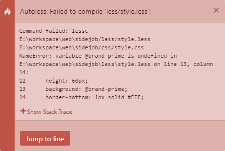

# autoless
Automate your LESS compilation workflow
 
 

Autoless is *Atom Package* which provides a clean looking interface for terminal based LESS compilations.

### Setup

For every project a new *.lessconfig* file is required. It's located in the root path
of your project. To create it automatically go to `Packages > Autoless > New Config`.

**Tip:** Predefined config values can be changed in the settings.
 
 

**Node Modules**

The following node modules are included:
- less
- less-plugin-clean-css
 
 

### Configurations

A quick overview of the in the *.lessconfig* file included properties:

|Property|Description|Default|
|---|---|---|
|`MINIFY`|If true, the *style.css* gets minified|`false`|
|`AUTO_COMPILE`|If true, it compiles on save *(Ctrl + S)*|`true`|
|`SOURCE_FILE`|The location of your *style.less* file|`less/style.less`|
|`TARGET_FILE`|The location of your *style.css* file|`css/style.css`|

 

### Screenshots
 

Success Notification
 
 

Error Notification with formatted error log and "Jump to line" button
